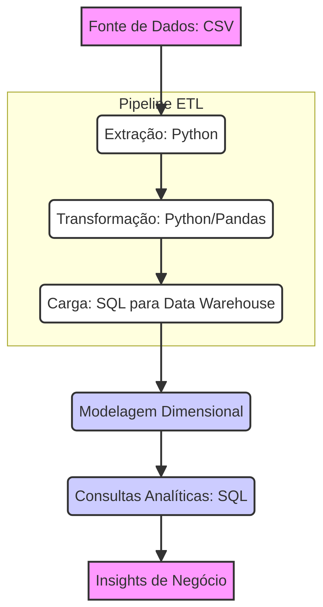

# dw-analytics-etl-python-sql: Pipeline ETL para Data Warehouse Analítico



Este projeto implementa um **Pipeline ETL (Extract, Transform, Load)** completo em Python, projetado para construir um Data Warehouse analítico. O objetivo é transformar dados brutos em informações estruturadas e prontas para análise, utilizando modelagem dimensional e consultas SQL para gerar insights de negócio.

## Visão Geral do Pipeline ETL

O pipeline é dividido em etapas claras para garantir a qualidade e a rastreabilidade dos dados:

*   **Extração (Extract):** Os dados brutos são extraídos de fontes externas (simuladas por arquivos CSV neste projeto) utilizando scripts Python.
*   **Transformação (Transform):** Nesta fase, os dados extraídos passam por processos de limpeza, padronização, enriquecimento e agregação. As transformações são realizadas em Python, utilizando bibliotecas como Pandas para manipulação eficiente dos dados.
*   **Carga (Load):** Os dados transformados são carregados em um banco de dados relacional, que serve como o Data Warehouse. A carga é otimizada para o modelo dimensional.

## Modelagem Dimensional e Consultas Analíticas

Após a carga dos dados, é aplicada a **modelagem dimensional**, organizando os dados em tabelas de fatos e dimensões. Isso facilita a criação de consultas analíticas complexas e a geração de relatórios de desempenho.

*   **Tabelas de Fatos:** Armazenam métricas e medidas quantitativas.
*   **Tabelas de Dimensões:** Fornecem contexto para as tabelas de fatos, descrevendo atributos como tempo, produto, cliente, etc.

## Tecnologias Utilizadas

| Categoria           | Tecnologia           | Versão (Exemplo) | Descrição                                                                                             |
| :------------------ | :------------------- | :--------------- | :---------------------------------------------------------------------------------------------------- |
| **Linguagem**       | Python               | 3.9+             | Linguagem principal para o desenvolvimento do pipeline ETL.                                           |
| **Manipulação Dados** | Pandas               | 1.4.x            | Para limpeza, transformação e manipulação de dados.                                                   |
| **Banco de Dados**  | PostgreSQL / SQLite  | (Exemplo)        | Banco de dados relacional para o Data Warehouse.                                                      |
| **SQL**             | SQL                  | ANSI SQL         | Para criação de esquemas, carga de dados e consultas analíticas.                                      |

## Como Executar

Para configurar e executar o projeto localmente, siga os passos abaixo:

1.  **Clone o repositório:**
    ```bash
    git clone https://github.com/brunobapa/dw-analytics-etl-python-sql.git
    cd dw-analytics-etl-python-sql
    ```

2.  **Crie e ative um ambiente virtual (recomendado):**
    ```bash
    python -m venv venv
    source venv/bin/activate  # No Windows: `venv\Scripts\activate`
    ```

3.  **Instale as dependências:**
    ```bash
    pip install -r requirements.txt
    ```

4.  **Execute o Pipeline ETL:**
    ```bash
    # Exemplo de execução dos scripts ETL (assumindo que os scripts estão em src/)
    python src/extract.py
    python src/transform.py
    python src/load.py
    ```
    *(Nota: Os nomes dos scripts e a estrutura de pastas podem variar. Verifique a pasta `src` para os nomes exatos dos arquivos.)*

## Autor

**Bruno Almeida**
Engenheiro de Dados com foco em construção de Data Warehouses e análise de dados.

Este projeto demonstra a capacidade de construir soluções robustas de ETL e modelagem de dados para fins analíticos.

## Licença

Este projeto está licenciado sob a Licença MIT. Veja o arquivo `LICENSE` para mais detalhes.
